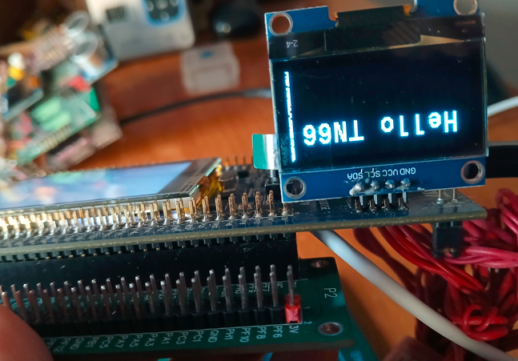

# GIAO TIẾP I2C

STM32 có sẵn __3 bộ driver điều khiển I2C__. Đoạn chương trình sau minh họa hiển thị ra màn hình OLED 1"3 qua giao tiếp I2C.
\
> Nội dung trong học phần Hệ nhúng, phần __Ghép nối STM32F429 với OLED SH1106__

## Kết nối STM32F429 với module cảm biến

## Cách lắp màn hình Oled vào Dev Kit STM32F429zIT-DISC1

Góc nhìn ngang:  \
Góc nhìn trên-xuống: 

## Các bước lập trình

1. Tạo dự án mới.
2. Mở file __.ioc__ và thiết lập xung nhịp đồng hồ CPU clock rate ở 180 MHz với 2 bước cấu hình như trong ảnh.
   - Kích hoạt __RCC__.\
    
   - Thiết lập __CPU Clock = 180MHz__.\
    
3. Vẫn ở file __.ioc__, kích hoạt drive điều khiển I2C. Cụ thể ở đây là __I2C3__ vì được nối thêm với cổng __CN2__ trên board kit, bên cạnh 2 dải chân pin __P1, P2__.\
    
4. Trong phần __Parameter Settings__, cấu hình tốc độ của I2C
    
5. Thêm các file sh1106.* và fonts.* vào project.
6. Thêm các mã nguồn vào file __main.c__
    - Khai báo thư viện cần thiết.

        ```C
        /* USER CODE BEGIN Includes */
        #include "sh1106.h"  // Thư viện được bổ sung thêm để điều khiển màn hình OLED 1.3"
        #include "string.h"  // Thư viện string.h để sử dụng hàm strlen()
        #include "stdio.h"   // Thư viện stdio.h để sử dụng hàm sprintf()
        /* USER CODE END Includes */
        ```

    - Và các lệnh để hiển thị lên màn hình __oled__

        ```C
        /* USER CODE BEGIN 2 */
        SH1106_Init();       		     // Khởi tạo màn hình OLED với Driver SSH1106
        char buf[100];		         // Chuẩn bị chuỗi hiển thị
        sprintf(buf, "%s", "Hello TN66");
        SH1106_GotoXY(12, 10);         // Di chuyển tới vị trí (điểm ảnh) để từ đó bắt đầu vẽ
        SH1106_Puts(buf, &Font_11x18, SH1106_COLOR_WHITE); //Đưa chuỗi lên màn hình
        SH1106_UpdateScreen();		 // Cập nhật tất cả thay đổi nói trên lên màn hình. 
                                    // Chú ý rằng các bước chuẩn bị trên chỉ đưa các điểm ảnh vào vùng đệm màn hình chứ chưa thực sự active vùng đệm đó.
        /* USER CODE END 2 */
        ```

## Kết quả

  
