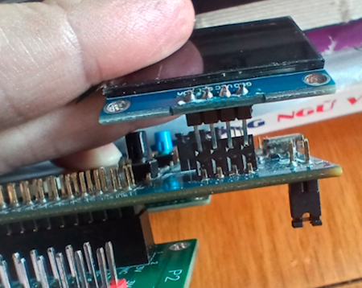
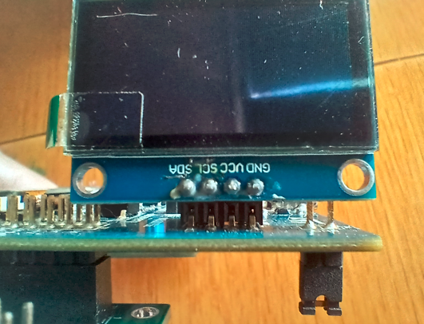
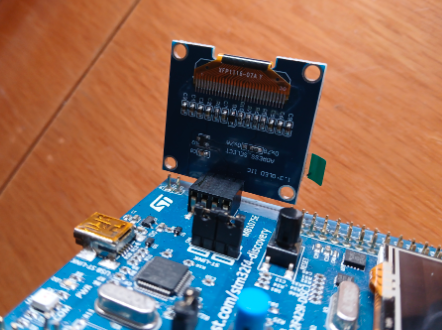
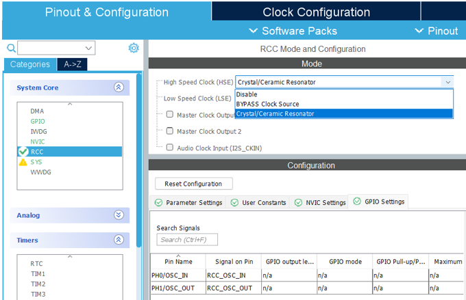
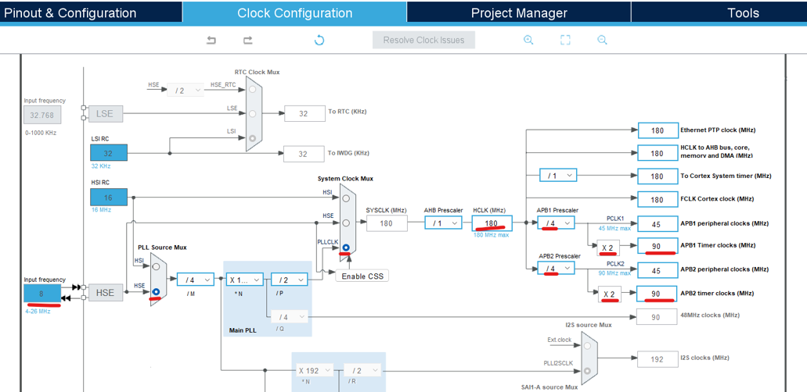
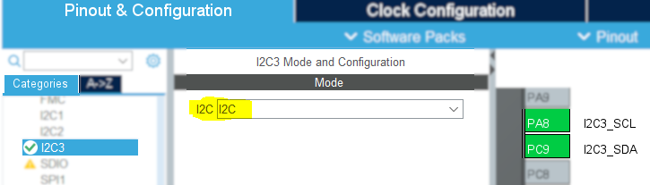
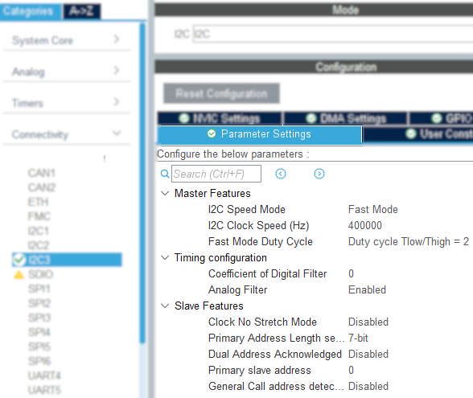

# GIAO TIẾP I2C

STM32 có sẵn __3 bộ driver điều khiển I2C__. Đoạn chương trình sau minh họa hiển thị ra màn hình OLED 1"3 qua giao tiếp I2C.

## Kết nối STM32F429 với module cảm biến

## Cách lắp màn hình Oled vào Dev Kit STM32F429zIT-DISC1

Góc nhìn ngang:  \
Góc nhìn trên-xuống: 

## Các bước lập trình

1. Tạo dự án mới.
2. Mở file __.ioc__ và thiết lập xung nhịp đồng hồ CPU clock rate ở 180 MHz với 2 bước cấu hình như trong ảnh.
   - Kích hoạt __RCC__.\
    
   - Thiết lập __CPU Clock = 180MHz__.\
    
3. Vẫn ở file __.ioc__, kích hoạt drive điều khiển I2C. Cụ thể ở đây là __I2C3__ vì được nối thêm với cổng __CN2__ trên board kit, bên cạnh 2 dải chân pin __P1, P2__.\
    
4. Trong phần __Parameter Settings__, cấu hình tốc độ của I2C
    
5.

## Kết quả
